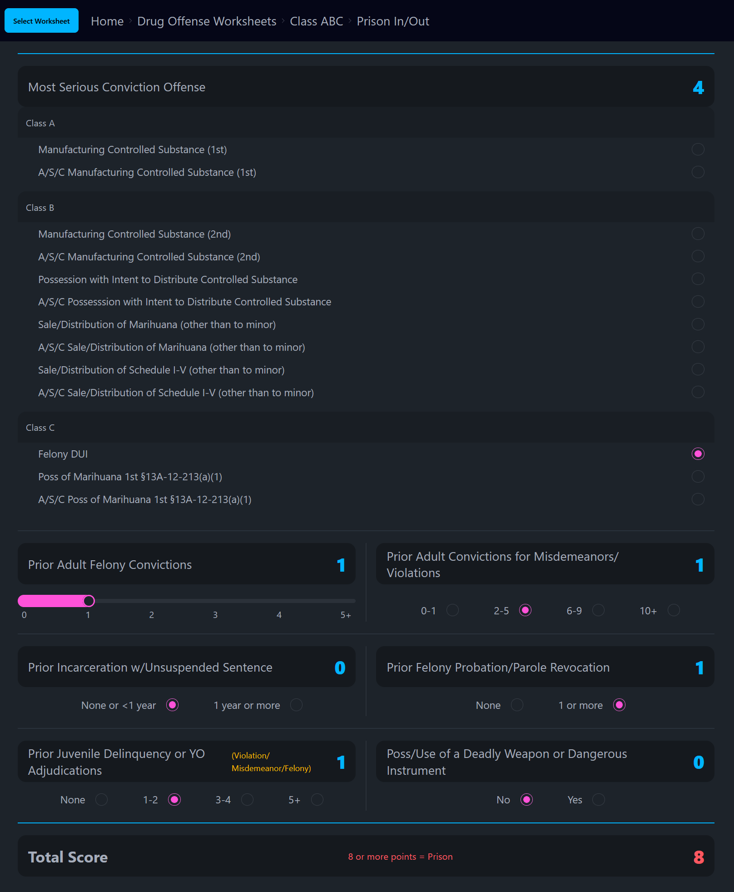

# Prison Sentence Estimator WebApp (WIP)

This will be a webapp to automate some of the calculations and scoring AL legal offices have to perform to estimate the sentencing of a particular offender. 
The original paper documents this will be based on can be found here: https://sentencingcommission.alacourt.gov/sentencing-standards/

I've agreed to take this project on after being asked by a friend's legal office.

I'm familiar with how to build websites/webapps from previous projects and education using vanilla HTML, CSS, JavaScript, & PHP. But I feel it would be a good learning experience to build something in a modern framework. Especially, since I would like to start deploying ML models on the web in the future.

I will be leveraging React + Vite for development. I am leveraging TailwindCSS + DaisyUI to help speed up some of the styling.

## Live Site
The working version of the site is live. My pushes to the main branch go into production through Netlify.
[Link](https://alworksheets.netlify.app)

## Samples

  
   

  
   

